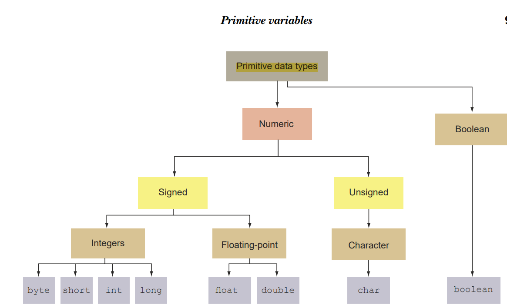

# Data Types

## Primitives

`char,byte,short,int,long,float,double,boolean`



### boolean

- A `boolean` can store only two values: `true` and `false`.
- ```java
  boolean productSold = true;
  boolean isEmail = false;
  ```

- `boolean result=false;`

    - `boolean`: variable type
    - `result` : variable
    - `false` : literal

- Variable: A variable is a named storage location in memory used to hold a value that can be referenced and manipulated
  in a program.
- Literal: A literal is a fixed value that doesn’t need further calculations in order for it to be assigned to any
  variable. Here `true` and `false` are literals.

### signed numeric - `byte, int, short, long`

- Signed numeric data types store integer values.

| Data Type | Size    | Range of values                        |
|-----------|---------|----------------------------------------|
| byte      | 8 bits  | -128 to 127, inclusive                 |
| short     | 16 bits | -32.768 to 32.767, inclusive           |
| int       | 32 bits | -2.14M to 2.14M, inclusive             |
| long      | 64 bits | $-9x10^{18}$ to $9x10^{18}$, inclusive |

- declaration and value assignment

```java

byte numberByte = 100;
short numberShort = 1240;
int numberInt = 48123;
long population = 214712342;

```

- The default type of a nondecimal number is `int`.

- definition of `long`: To designate an integer literal value as a `long` value, add the suffix `L` or `l`.

```java
long numberOfAnimalsInTheCity = 78283838485832L;
```

- Integer literal values come from in four flavors: binary, decimal, octal, hexadecimal:

    - Binary number system—A base-2 system, which uses only 2 digits, 0 and 1.
    - Octal number system—A base-8 system, which uses digits 0 through 7 (a total of 8
      digits). Here the decimal number 8 is represented as octal 10, decimal 9 as 11,
      and so on.
    - Decimal number system—The base-10 number system that you use every day. It’s
      based on 10 digits, from 0 through 9 (a total of 10 digits).
    - Hexadecimal number system—A base-16 system, which uses digits 0 through 9 and
      the letters A through F (a total of 16 digits and letters). Here the number 10 is
      represented as A or a, 11 as B or b, 12 as C or c, 13 as D or d, 14 as E or e, and 15
      as F or f.

- Assigment of integer literals:

```java
int baseDecimal = 134;
int octValue = 0412;
int hexValue = 0x10B;
int binaryValue = 0b10000100;

```

- Underscore for grouping individual digits or letters of literal values.

```java
int baseDecimal = 1_342_322;
int octValue = 04_12;
int hexValue = 0x10_AB_32;
int binaryValue = 0b1000_0100_1101;

```

- Rules for usage of underscores in the numerical literal values:
    - You can place an underscore right after the prefix 0, which is used to define an
      octal literal value.
    - You can’t start or end a literal value with an underscore.
    - You can’t place an underscore right after the prefixes 0b, 0B, 0x, and 0X, which
      are used to define binary and hexadecimal literal values.
    - You can’t place an underscore prior to an L suffix (the L suffix is used to mark a
      literal value as long).
    - You can’t use an underscore in positions where <u>a string of digits</u> is expected
      (see the following example)

```java
 int baseDecimal1 = _10;
int baseDecimal2 = 1_;
int getOctValue1 = 0_123_;
int binaryValue1 = 0b_10;
int binaryValue2 = 0B_10;
int binaryValue3 = 0X_10;
int binaryValue4 = 0X_10;
long number = 10_L;
int i = Integer.parseInt("12_33");  //Number Format Exception
```

## Floating Numbers: `double` and `float`

- `float` store decimal numbers in 32 Bits.
- `double` store decimal numbers in 64 Bits.
- Range of decimal numbers:
  | Data Type | Size | Range of values |
  |-----------|---------|----------------------------------------|
  | `float`   | 32 Bits | ±1.4E-45 to ±3.4E+38, ±∞, ±0, NaN |
  | `double`  | 64 Bits | ±4.9E-324 to ±1.79E+308, ±∞, ±0, NaN |
- The default type of decimal literal is double.
- The ``float`` type is defined by the use of `f` or `F` suffix.
    ````java
    float average = 20.129F;
    float orbit = 1765.65f;
    double inclination = 120.1762;

    ````
- Scientific notation ``E`` or `e` can also be used to assign a decimal number.

````java
    double inclination = 1.201E2;
````

The value of the variable ``inclination`` here is $120.1$.

- The suffix ``D`` or `d` can also be used to specify a double literal. But it is redundant because the default type of
  a decimal without any suffix is `double`.
- The underscore rules are generally the same as the other numeric literal values. In addition:
    + Underscore can not be placed prior to a ``f``, `F`, `D` or `d` suffix.
    + Underscore can not be placed adjacent to a decimal point.
  ````java
    float floatLiteral = 100._48F; 
    double doubleLiteral = 100_.87;
    float floatLiteral2 = 100.48_F;
    double doubleLiteral2 = 100.87_d;

````