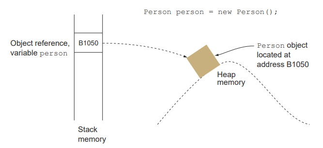
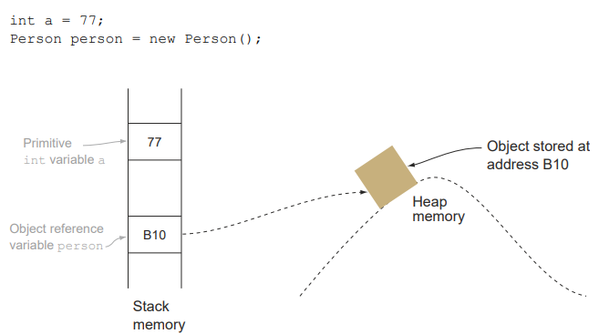

# Data Types

## Primitives

`char,byte,short,int,long,float,double,boolean`


### boolean

- A `boolean` can store only two values: `true` and `false`.
- ```java
  boolean productSold = true;
  boolean isEmail = false;
  ```

- `boolean result=false;`

    - `boolean`: variable type
    - `result` : variable
    - `false` : literal

- Variable: A variable is a named storage location in memory used to hold a value that can be referenced and manipulated
  in a program.
- Literal: A literal is a fixed value that doesn’t need further calculations in order for it to be assigned to any
  variable. Here `true` and `false` are literals.

### signed numeric - `byte, int, short, long`

- Signed numeric data types store integer values.

| Data Type | Size    | Range of values                        |
|-----------|---------|----------------------------------------|
| byte      | 8 bits  | -128 to 127, inclusive                 |
| short     | 16 bits | -32.768 to 32.767, inclusive           |
| int       | 32 bits | -2.14M to 2.14M, inclusive             |
| long      | 64 bits | $-9x10^{18}$ to $9x10^{18}$, inclusive |

- declaration and value assignment

```java

byte numberByte = 100;
short numberShort = 1240;
int numberInt = 48123;
long population = 214712342;

```

- The default type of a nondecimal number is `int`.

- definition of `long`: To designate an integer literal value as a `long` value, add the suffix `L` or `l`.

```java
long numberOfAnimalsInTheCity = 78283838485832L;
```

- Integer literal values come from in four flavors: binary, decimal, octal, hexadecimal:

    - Binary number system—A base-2 system, which uses only 2 digits, 0 and 1.
    - Octal number system—A base-8 system, which uses digits 0 through 7 (a total of 8
      digits). Here the decimal number 8 is represented as octal 10, decimal 9 as 11,
      and so on.
    - Decimal number system—The base-10 number system that you use every day. It’s
      based on 10 digits, from 0 through 9 (a total of 10 digits).
    - Hexadecimal number system—A base-16 system, which uses digits 0 through 9 and
      the letters A through F (a total of 16 digits and letters). Here the number 10 is
      represented as A or a, 11 as B or b, 12 as C or c, 13 as D or d, 14 as E or e, and 15
      as F or f.

- Assigment of integer literals:

```java
int baseDecimal = 134;
int octValue = 0412;
int hexValue = 0x10B;
int binaryValue = 0b10000100;

```

- Underscore for grouping individual digits or letters of literal values.

```java
int baseDecimal = 1_342_322;
int octValue = 04_12;
int hexValue = 0x10_AB_32;
int binaryValue = 0b1000_0100_1101;

```

- Rules for usage of underscores in the numerical literal values:
    - You can place an underscore right after the prefix 0, which is used to define an
      octal literal value.
    - You can’t start or end a literal value with an underscore.
    - You can’t place an underscore right after the prefixes 0b, 0B, 0x, and 0X, which
      are used to define binary and hexadecimal literal values.
    - You can’t place an underscore prior to an L suffix (the L suffix is used to mark a
      literal value as long).
    - You can’t use an underscore in positions where <u>a string of digits</u> is expected
      (see the following example)

```java
int baseDecimal1 = _10;
int baseDecimal2 = 1_;
int getOctValue1 = 0_123_;
int binaryValue1 = 0b_10;
int binaryValue2 = 0B_10;
int binaryValue3 = 0X_10;
int binaryValue4 = 0X_10;
long number = 10_L;
int i = Integer.parseInt("12_33");  //Number Format Exception
```

## Floating Numbers: `double` and `float`

- `float` store decimal numbers in 32 Bits.
- `double` store decimal numbers in 64 Bits.
- Range of decimal numbers:
  | Data Type | Size | Range of values |
  |-----------|---------|----------------------------------------|
  | `float`   | 32 Bits | ±1.4E-45 to ±3.4E+38, ±∞, ±0, NaN |
  | `double`  | 64 Bits | ±4.9E-324 to ±1.79E+308, ±∞, ±0, NaN |
- The default type of decimal literal is double.
- The ``float`` type is defined by the use of `f` or `F` suffix.
    ````java
    float average = 20.129F;
    float orbit = 1765.65f;
    double inclination = 120.1762;

    ````
- Scientific notation ``E`` or `e` can also be used to assign a decimal number.

````java
    double inclination = 1.201E2;
````

The value of the variable ``inclination`` here is $120.1$.

- The suffix ``D`` or `d` can also be used to specify a double literal. But it is redundant because the default type of
  a decimal without any suffix is `double`.
- The underscore rules are generally the same as the other numeric literal values. In addition:
    + Underscore can not be placed prior to a ``f``, `F`, `D` or `d` suffix.
    + Underscore can not be placed adjacent to a decimal point.

````java
float floatLiteral = 100._48F;
double doubleLiteral = 100_.87;
float floatLiteral2 = 100.48_F;
double doubleLiteral2 = 100.87_d;
````

- Default values of primitives in Java.
    + ``byte``: The default value is 0.
    + ``short``: The default value is 0.
    + ``int``: The default value is 0.
    + ``long``: The default value is ``0L``.
    + ``float``: The default value is ``0.0f``.
    + ``double``: The default value is ``0.0d``.
    + ``char``: The default value is ``\u0000`` (``null`` character).
    + ``boolean``: The default value is ``false``.

## `char`

- A `char` is an **unsigned integer** that can store 16-bit Unicode characters like Japanese, Korean, French alphabet
  characters.
- Unicode characters are defined by ``\uxxxx`` (from \u0000 (or 0) to \uffff (or 65_535)).
- The assigment to a ``char`` variable is done by '' (single quotes).
    ````java
        char c1='X';
    ````
- Double quotes are used by the assigment of String.
- By the use of double quotes at the assigment of ``char`` variable produces ``Type mismatch`` error.
- Java stores ``char`` data as an unsigned integer value (positive integer). But this value is the representation of the
  ASCII character value of the character.
    ````java
    char c1 = 122; // assign z to c1
   ````
  In this example ASCII value of 122 is character 'z', but the '\u0122' Unicode is not equal to 'z'. (
  s. https://en.wikipedia.org/wiki/List_of_Unicode_characters)

- ``char`` is unsigned integer and can not be assigned negative numbers.
    ````java
        char c3=-122; // can not be compiled
    ````

- But casting is possible in this case.

    ````java
    char c3 = (char) -122; //
    ````
- Casting is the forceful conversion of one data type to another one.
- At the casting of a negatively assigned integer to a ``char`` can lead unexpected storages. Because the sign bit is
  stored as the part of the integer value.

## Identifiers

- Identifiers are names of packages, classes, interfaces, methods, and variables.
- The length of the identifiers has no limit.
- Identifiers can use in any position (_)
- Identifiers can use in any position ( $, £, ¢, ¥, and others)
- Identifiers can start with a letter(a-z, A-Z), a currency sign or an underscore.
- Identifiers can not start with a digit (0-9), but can be used in any position except Start.
- special characters of Java can not be used in any position in identifiers: ``!, @, #, %, ^, &, *, (, ),
  ', :, ;, [, /, \, }`` und Leer Zeichen
- Valid Identifiers: ``isPrime, $value, _cosine, Name, nameAndSurname, degree, AGE, _TOTaL___``
- Invalid Identifiers: ``3dogs, %prozentValue, Digital!, a@domain.org``
- Java keywords and reserved words can not be used as identifier.
  Java Keywords(Java 8)
  **abstract default goto package this
  assert do if private throw
  boolean double implements protected throws
  break else import public transient
  byte enum instanceof return true
  case extends int short try
  catch false interface static void
  char final long strictfp volatile
  class finally native super while
  const float new switch
  continue for null synchronized**
- Diese are invalid identifiers: ``null, goto, if, true, do, ...``
- But can be used in the identifiers-not only. Diese are valid: ``trueFalse, isTrue, nullCheck, doIt``
- In practice, variables are defined as camelCase(not necessary).
- Class names are usually defined in PascalCase, but preferred usually a single word as class name.
- Constants are generally defined with CAPITALLETTERS. ```VAT, VALUEADDEDTAX, MEHRWERTSTEUER```
- Casings:
    + camelCase: int numberOfStudents = 1;
    + PascalCase: int NumberOfStudents = 2;
    + snake_case: int number_of_students = 3;
    + kebap-case: int number-of-students = 4; * not in Java, generally in URL names, project names, HTML and CSS

## Object Reference Variables

- Object reference variables =references variables = object references
- Objects are instances of classes: predefined or user-defined classes
- An object reference is **a memory address** that points to a memory area where an object's data located.

````java
    Animal animal = new Animal();
````

Animal: Type of object reference variable
animal: name of object reference variable
Animal(): Object
new: Operator used to create a new object

- Reference variable is stored in **Stack**.
- Object is located in **Heap**.
  
- The default value of all types of object reference variables is ``null``.
- The literal value for all types of object reference variables is ``null``.
- Primitive variables store the actual values, reference variables store the addresses of the objects they refer to.
  

## Operators

| Operator type | Operators                | Purpose                                                |
|---------------|--------------------------|--------------------------------------------------------|
| Assigment     | =, +=, -=, *=, /=        | Assign value to a variable                             |
| Arithmetic    | +, -, *, /, %, ++, --    | Add, subtract, multiply, divide, and modulus primitive |
| Relational    | <, < =, >, > =, = =, ! = | Compare primitives                                     |
| Logical       | !, &&, \| \|             | Compare primitives                                     |

### Assignment Operators

- The simple assignment operator, =, is the most frequently used operator.
- The +=, -=, *=, and /= operators are short forms of addition, subtraction, multiplication, and division with
  assignment.

```m
a -=b is equal to a =a –b
a +=b is equal to a = a + b
a *=b  is equal to a =a *b
a /=b is equal to a =a /b
a %= b is equal to a =a %b
```

- In der Mathematik bezeichnet der Modulo-Operator die Operation, bei der der Rest einer Division zweier Zahlen
  berechnet wird.
- Squeezing the variables that can store a larger range of values into variables with a shorter range.
  Example:

````java
long num = 100976543356L;
int val = num; 
````

not allowed.

- An ``int`` can easily fit into a ``long`` because there’s enough room for it.

````java
int integerValue = 100;
long longValue = integerValue; 
````

- You can’t use the assignment operators to assign a ``boolean`` value
  to variables of type ``char, byte, int, short, long, float, or double``, or vice versa.
- Assignment multiple values on the same line using the **assignment operator (=)** is allowed.

````java
int a = 7, b = 10, c = 8;
a =b =c; 
````

## Arithmetic Operators

| Operator | Purpose                                         | Usage                | Answer                           |
|----------|-------------------------------------------------|----------------------|----------------------------------|
| +        | Addition                                        | 12 + 10              | 22                               |
| -        | Subtraction                                     | 19 – 29              | -10                              |
| *        | Multiplication                                  | 101 * 45             | 4545                             |
| /        | Division (quotient) (Integer)                   | 10 / 6               | 1                                |
| /        | Division (quotient) (Double)                    | 10.0 / 6.0           | 1.66666666667                    |
| %        | Modulus (remainder in division)                 | 10 % 6 or 10.0 % 6.0 | 4 or 4.0                         |
| ++       | Unary increment operator; increments value by 1 | ++var or var++       | 11 (assuming value of var is 10) |
| --       | Unary decrement operator; decrements value by 1 | --var or var--       | 9 (assuming value of var is 10)  |

- Unary increment and decrement operators are allowed to use only with variables but not with literal values. If you do,
  the code won’t compile.

- You can use all arithmetic operators with the ``char`` primitive data type, including unary increment and decrement
  operators.

````java
char char1 = 'a';
System.out.

println(char1); //a
System.out.

print(char1+char1); //194

char char2 = 'a';
System.out.

print(char2-char2); //0
````

### Implicit Widening of data types in a aritmetic operation

- All ``byte, short``, and ``char`` values are automatically widened to ``int`` when used as operands for arithmetic
  operations.

````java
byte age1 = 10;
byte age2 = 20;
short sum = age1 + age2;
````

- If a ``long`` value is involved somewhere, then everything, including ``int`` values, is widened to ``long``.
- If an arithmetic operation includes a data type of ``float`` or ``double``, all operand values are widened to double.
- If you define variables as ``final``variables, then the compiler is assured that their sum,
  can be assigned to a variable of type ``short``, without any loss of precision (widening).

````java
final byte age1 = 10;
final byte age2 = 20;
short sum = age1 + age2; 
````

### Unary increment und decrement
